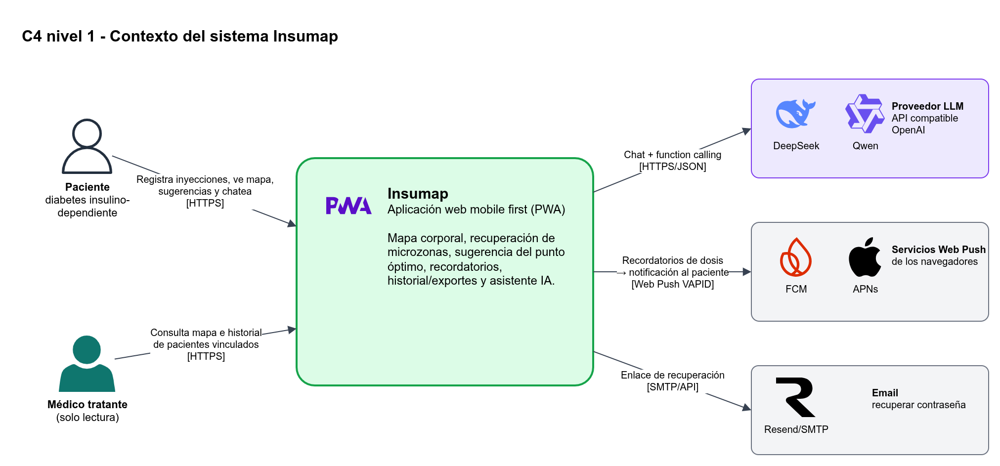
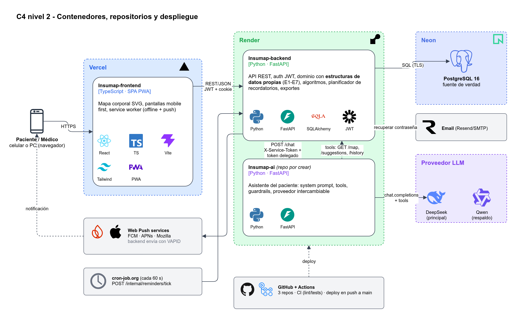
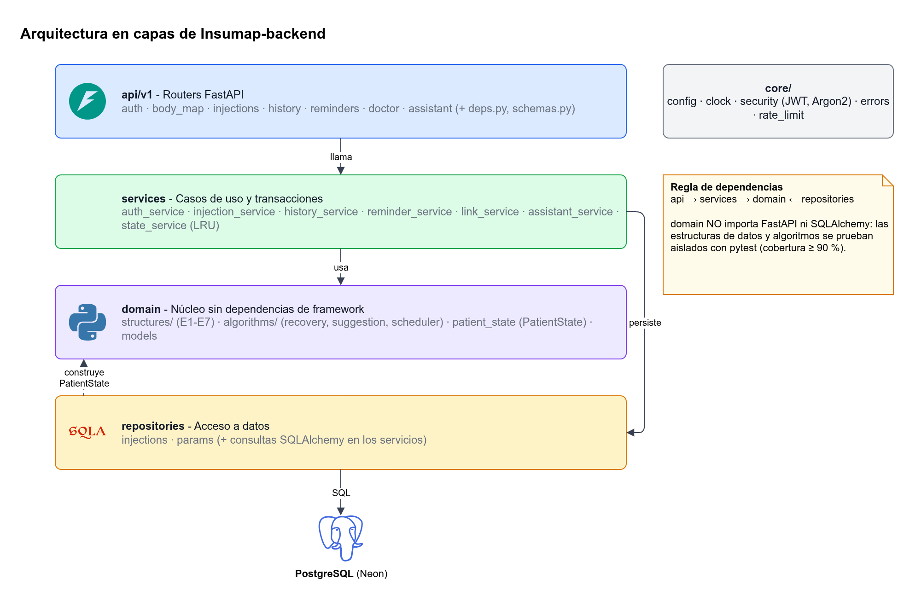
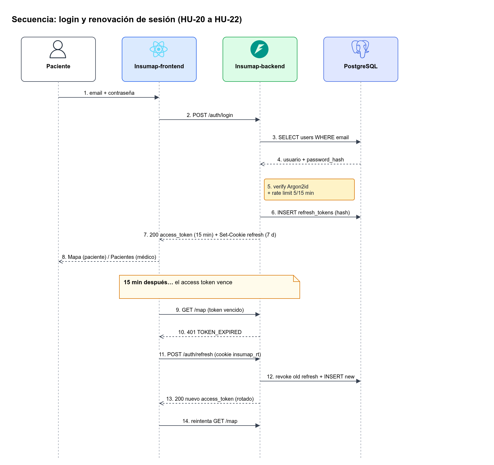
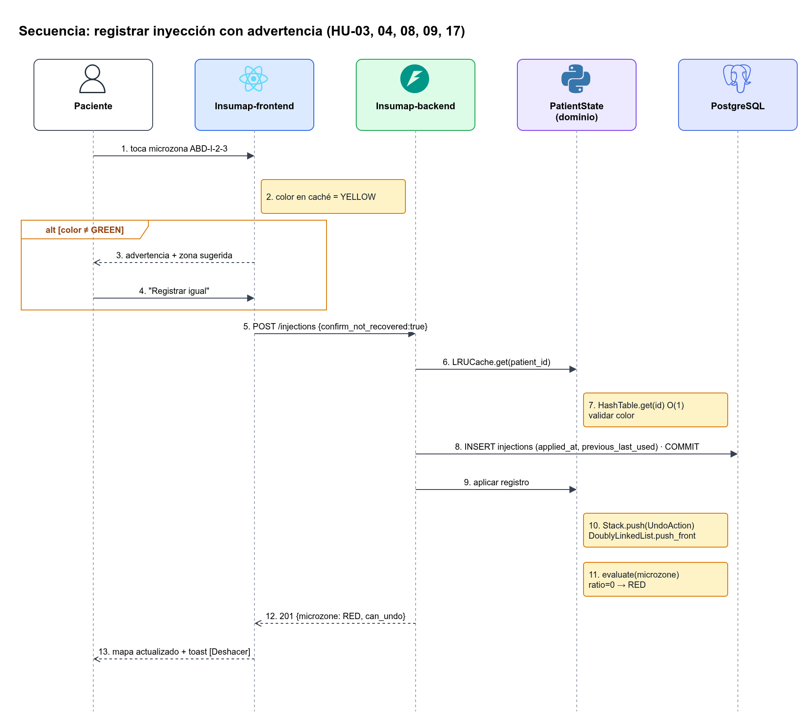
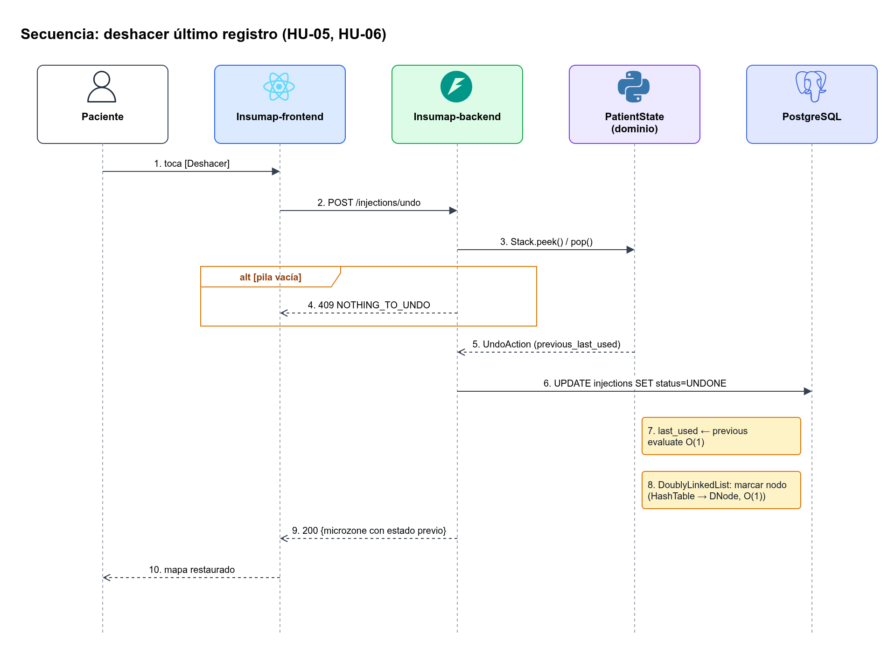
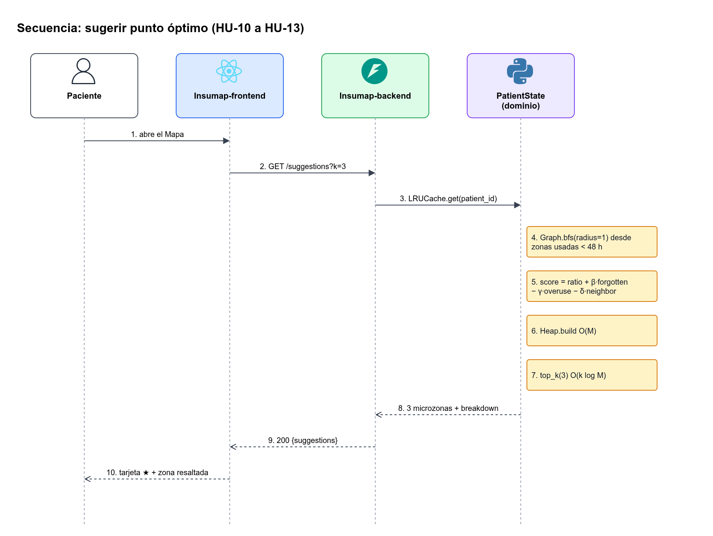
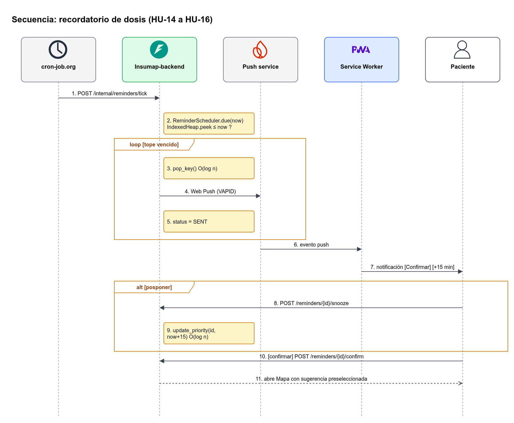
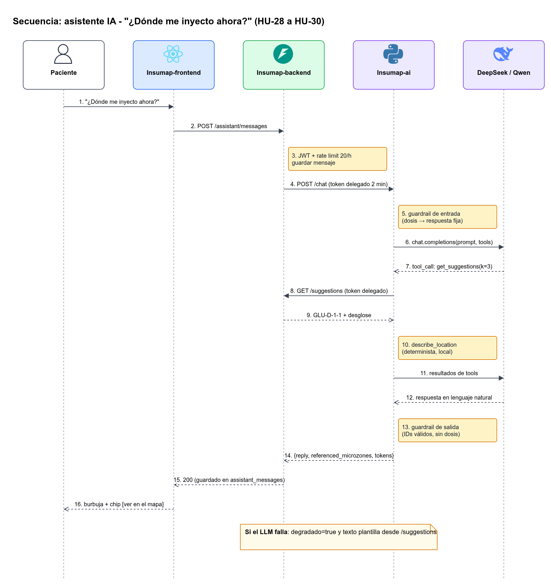
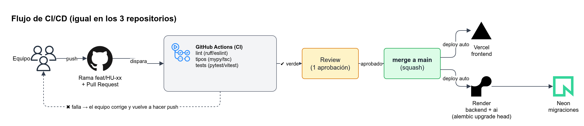

# Arquitectura

Insumap es una **aplicación web mobile first (PWA)** con una arquitectura de **3 servicios desplegables por separado**. Cada uno vive en su propio repositorio y despliega de forma automática.

| Repositorio | Lenguaje | Responsabilidad | Despliegue |
|---|---|---|---|
| `Insumap-frontend` | TypeScript | Interfaz mobile first, mapa corporal SVG, PWA, Web Push en el cliente | Vercel |
| `Insumap-backend` | Python | API REST, autenticación, dominio (estructuras de datos y algoritmos), recordatorios, exportes | Render |
| `Insumap-ai` *(repo por crear)* | Python | Asistente IA del paciente: orquesta el LLM (DeepSeek/Qwen) y sus tools | Render |
| — | — | Base de datos PostgreSQL | Neon |

> La documentación del proyecto vive en `docs/` del repositorio `Insumap-backend`.

---

## 1. Contexto (C4 nivel 1)



- **Paciente:** registra inyecciones, consulta el mapa y las sugerencias, configura recordatorios, conversa con el asistente y exporta su historial.
- **Médico:** se vincula con un paciente mediante un código y consulta su mapa e historial (solo lectura), además de exportarlo.
- **Sistemas externos:**
  - Proveedor LLM (DeepSeek, o Qwen como alternativa).
  - Servicio de push del navegador (FCM para Chrome/Android, APNs Web Push para Safari/iOS y Mozilla Push).
  - Servicio de email para la recuperación de contraseña.

## 2. Contenedores (C4 nivel 2) y despliegue



| Desde | Hacia | Protocolo | Para qué |
|---|---|---|---|
| Frontend PWA | Backend | HTTPS / JSON (REST), JWT Bearer + cookie httpOnly de refresh | Toda la funcionalidad |
| Backend | PostgreSQL | TCP/TLS (SQLAlchemy) | Persistencia |
| Backend | `Insumap-ai` | HTTPS / JSON con `X-Service-Token` + token delegado del paciente | Reenviar el mensaje del asistente |
| `Insumap-ai` | Backend | HTTPS / JSON con el token delegado | Ejecutar tools (`get_mapa`, `get_sugerencia`, ...) |
| `Insumap-ai` | DeepSeek / Qwen | HTTPS (API compatible con OpenAI) | Chat completions con function calling |
| Backend | Push service | Web Push (VAPID) | Recordatorios de dosis |
| Cron externo | Backend | HTTPS `POST /internal/reminders/tick` | Mantener vivo el planificador (ver [Riesgos](Riesgos.md)) |

**Decisión clave:** el frontend **nunca** habla directamente con `Insumap-ai` ni con el LLM. Todo pasa por el backend, que autentica, aplica el rate limit y registra. La API key del LLM vive solo en `Insumap-ai`.

## 3. Arquitectura interna del backend (capas)



```text
Insumap-backend/
├── app/
│   ├── api/
│   │   ├── deps.py        # sesión de BD, usuario actual y guardas por rol / vínculo / token delegado
│   │   ├── schemas.py     # modelos Pydantic de request/response
│   │   └── v1/            # routers: auth, body_map, injections, history, reminders, doctor, assistant
│   ├── services/          # casos de uso: transacción + sincronización del PatientState (state_service = caché LRU)
│   ├── domain/            # sin FastAPI ni SQLAlchemy (mypy --strict)
│   │   ├── structures/    # E1–E7 hechas a mano: Grid, HashTable, Stack, Heap/IndexedHeap, DoublyLinkedList, Graph, LRUCache
│   │   ├── algorithms/    # recovery.py (5.1), suggestion.py (5.2), scheduler.py (5.4)
│   │   ├── patient_state.py  # PatientState
│   │   ├── models.py      # Microzone, Params, UndoAction, InjectionView, enums
│   │   └── location.py    # describe_location (texto anatómico para el usuario)
│   ├── repositories/      # consultas SQLAlchemy reutilizables
│   ├── db/                # Base, tipos UTCDateTime/JSONB, modelos ORM, sesión, seed
│   ├── core/              # config, clock, errors, security (Argon2 + JWT), rate_limit
│   └── main.py            # app FastAPI, CORS, manejadores de error, lifespan (seed + min-heap + APScheduler)
├── alembic/               # migraciones
└── tests/  (domain/, api/)
```

**Regla de dependencias:** `api → services → domain ← repositories`. El paquete `domain` **no importa** FastAPI ni SQLAlchemy, así que las estructuras y algoritmos se prueban de forma aislada y rápida.

### Frontend (`Insumap-frontend`)

```text
src/
├── app/            # router, providers (QueryClient, Auth)
├── pages/          # Login, Registro, Mapa, Historial, Cronograma, Asistente, Medico/...
├── features/       # auth/, mapa/, inyecciones/, sugerencias/, recordatorios/, asistente/
├── components/     # BodyMap (SVG), MicrozonaCell, BottomNav, Toast, ...
├── lib/            # apiClient (fetch + refresh automático), zod schemas, push.ts
└── sw.ts           # service worker (PWA + Web Push)
```

### Servicio IA (`Insumap-ai`)

```text
app/
├── main.py            # FastAPI: POST /chat
├── llm/client.py      # SDK openai con base_url/model desde env (DeepSeek | Qwen)
├── tools/             # get_map, get_suggestions, get_history, describe_location
├── prompts/system.md  # system prompt versionado
└── guardrails.py      # filtros de entrada y salida (no dosis, no diagnóstico)
```

## 4. Flujos principales (diagramas de secuencia)

### 4.1 Login y renovación de sesión (R20–R23)


### 4.2 Registrar inyección con advertencia (R03, R04, R08, R09, R17)


### 4.3 Deshacer último registro (R05, R06)


### 4.4 Pedir sugerencia (R10–R13)


### 4.5 Recordatorio de dosis (R14–R16)


### 4.6 Consulta al asistente IA (R28–R30)


Resumen del flujo **registrar inyección**:
1. El paciente toca la microzona en el SVG y el frontend lee su color en el mapa cacheado (TanStack Query).
2. Si no está en `GREEN`, el frontend muestra el diálogo de advertencia (R04). El paciente confirma.
3. `POST /api/v1/injections {microzone_id, applied_at, confirm_not_recovered: true}`.
4. `injection_service.register` toma el lock, obtiene el `PatientState` de la caché LRU, ubica la microzona en la tabla hash y valida el color. Si no está en VERDE y no viene la confirmación, responde 409 `MICROZONE_NOT_RECOVERED`.
5. Inserta en `injections` y hace commit; después aplica el registro en memoria (`PatientState.register`): apila el `UndoAction`, inserta al inicio del historial y la microzona pasa a `RED`. Si algo falla, invalida la caché.
6. Responde `201` con la microzona actualizada. El frontend invalida las consultas `map` y `suggestions`.

## 5. Ambientes y variables de entorno

| Ambiente | Frontend | Backend / IA | BD |
|---|---|---|---|
| Local | `vite dev` | `uvicorn --reload` | PostgreSQL en Docker (`docker compose up db`) |
| Preview | Vercel Preview por PR | — | Branch de Neon (opcional) |
| Producción | Vercel (`main`) | Render (`main`) | Neon (rama `main`) |

| Variable | Servicio | Descripción |
|---|---|---|
| `VITE_API_URL` | frontend | URL del backend |
| `VITE_VAPID_PUBLIC_KEY` | frontend | Llave pública para suscribirse a Web Push |
| `DATABASE_URL` | backend | Cadena de conexión de Neon |
| `JWT_SECRET`, `JWT_ACCESS_MIN=15`, `JWT_REFRESH_DIAS=7` | backend | Firma y vigencia de los tokens |
| `VAPID_PRIVATE_KEY`, `VAPID_SUBJECT` | backend | Envío de Web Push |
| `AI_SERVICE_URL`, `AI_SERVICE_TOKEN` | backend | Llamar a `Insumap-ai` |
| `CRON_TOKEN` | backend | Proteger `/internal/reminders/tick` |
| `SMTP_*` o `RESEND_API_KEY` | backend | Email de recuperación de contraseña |
| `CORS_ORIGINS` | backend | Dominio de Vercel |
| `LLM_BASE_URL`, `LLM_API_KEY`, `LLM_MODEL` | ia | Proveedor intercambiable (ver [Módulo IA](Modulo-IA.md)) |
| `BACKEND_URL`, `SERVICE_TOKEN` | ia | Ejecutar tools contra el backend |

Los secretos se guardan **solo** en los paneles de Render y Vercel y en los *secrets* de GitHub Actions. Nunca se suben al repositorio; cada repo trae un `.env.example`.

## 6. CI/CD



- **En cada PR:** GitHub Actions ejecuta lint (ruff / eslint), los checks de tipos (mypy / tsc) y los tests (pytest / vitest). El merge requiere checks en verde y 1 review.
- **En cada merge a `main`:** Vercel y Render despliegan automáticamente y el backend ejecuta `alembic upgrade head` en el *pre-deploy*.
- **Contrato:** el backend publica `openapi.json`. El frontend genera sus tipos con `openapi-typescript` y la IA valida sus tools contra el mismo contrato.

Relacionadas: [Stack tecnológico](Stack-tecnologico.md) · [API](API.md) · [Modelo de datos](Modelo-de-datos.md) · [Estructuras de datos y algoritmos](Estructuras-de-datos-y-algoritmos.md)
