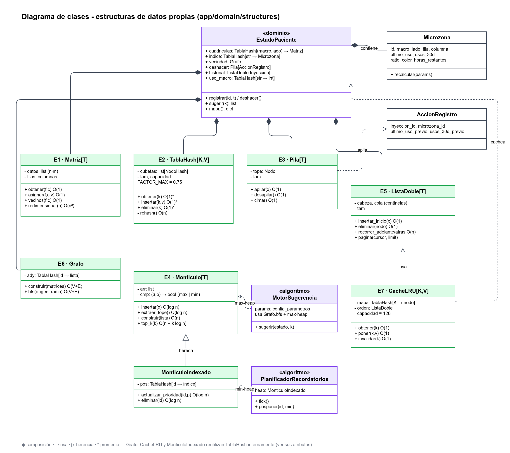
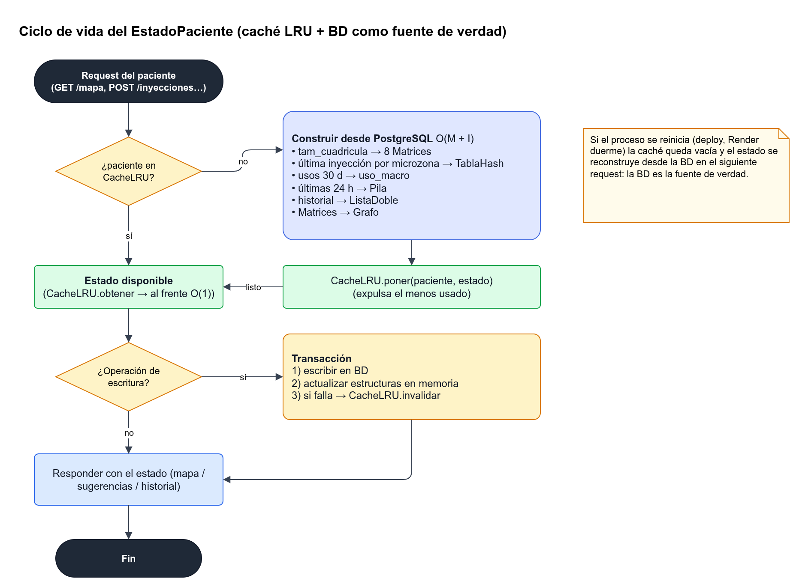
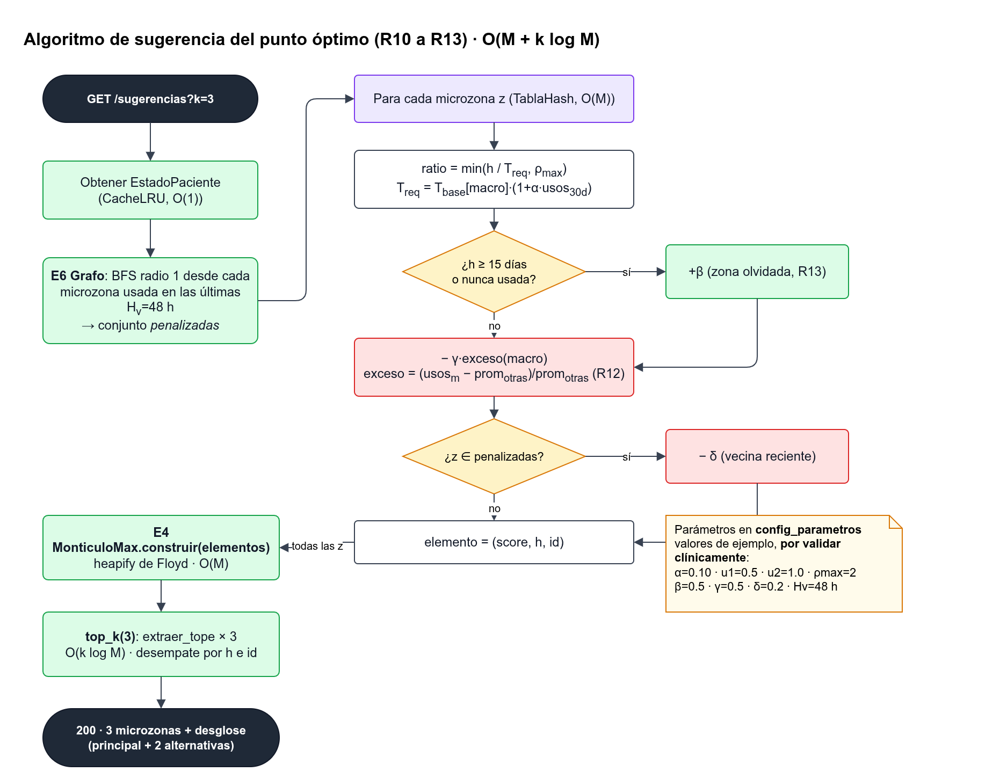

# Estructuras de datos y algoritmos

Esta página es el **núcleo académico** de Insumap. Explica qué estructuras de datos usa el sistema, por qué se eligió cada una, qué requisito resuelve, su complejidad y cómo se conectan entre sí.

> **Regla del proyecto:** todas las estructuras se implementan **a mano en Python** en el repositorio `Insumap-backend`, carpeta `app/domain/structures/`. No se usan `heapq`, `collections.deque`, `OrderedDict` ni `functools.lru_cache` como sustituto de la estructura. Los tipos nativos se usan solo como almacenamiento primitivo (por ejemplo, una `list` de tamaño fijo como arreglo). Cada estructura tiene su archivo de pruebas en `tests/structures/` (pytest).



---

## 1. Resumen: qué estructura resuelve qué requisito

| # | Estructura | Archivo | Uso en Insumap | Requisitos | HU |
|---|---|---|---|---|---|
| E1 | Matriz (cuadrícula) | `grid.py` | Microzonas de cada zona macro y lado | R01, R02, R03 | HU-01, HU-02, HU-03 |
| E2 | Tabla hash (encadenamiento) | `hash_table.py` | Índice `id_microzona → Microzona`, índices auxiliares | R03, R07, R08, R09 | HU-03, HU-07, HU-08, HU-09 |
| E3 | Pila | `stack.py` | Deshacer registros y restaurar el estado previo | R05, R06 | HU-05, HU-06 |
| E4 | Montículo binario (max y min) | `heap.py` | Max: sugerencia del punto óptimo. Min: cola de recordatorios | R10–R13, R14–R16 | HU-10–HU-16 |
| E5 | Lista doblemente enlazada | `doubly_linked_list.py` | Historial navegable en ambos sentidos | R17, R18, R19 | HU-17, HU-18, HU-19 |
| E6 | Grafo (lista de adyacencia) | `graph.py` | Vecindad entre microzonas: evitar sugerir puntos pegados a uno usado hace poco | R11 | HU-11 |
| E7 | Caché LRU (E2 + E5) | `lru_cache.py` | Cachear el `EstadoPaciente` en memoria para responder el mapa rápido | RNF-02 | HU-01, HU-07 |

Todas estas estructuras se agrupan en un único objeto de dominio, **`EstadoPaciente`** (sección 3). Ese objeto es lo que consultan los servicios del backend y el asistente IA (vía tools).

---

## 2. Identificación de una microzona

El cuerpo se divide en **4 zonas macro** (R01) y cada una tiene **lado izquierdo (I) y derecho (D)**. Cada lado se subdivide en una cuadrícula `n × n` con `n ∈ {2, 4, 6}` (R02, configurable por paciente, 4 por defecto).

| Zona macro | Código |
|---|---|
| Abdomen (izq./der. del ombligo) | `ABD` |
| Muslos | `MUS` |
| Brazos (cara posterior) | `BRA` |
| Glúteos (cuadrante superior externo) | `GLU` |

**Formato del ID:** `{MACRO}-{LADO}-{FILA}-{COLUMNA}`, con fila y columna desde 1. Por ejemplo, `ABD-I-2-3` es el abdomen izquierdo, fila 2, columna 3.

Total de microzonas por paciente: `4 macros × 2 lados × n²`. Con `n = 4` son 128 y con `n = 6`, 288. Como el tamaño es pequeño y acotado, todo el estado de un paciente cabe en memoria.

Este ID es el mismo en todas las capas: en la BD (`inyeccion.microzona_id`), en la API (`/inyecciones`, `/mapa`), en el frontend (atributo `data-microzona` del SVG) y en las tools del asistente IA.

---

## 3. Objeto de dominio `EstadoPaciente`

```text
EstadoPaciente
├── cuadriculas : TablaHash[(macro, lado) → Matriz[Microzona]]   (E2 + E1)
├── indice      : TablaHash[id_microzona → Microzona]            (E2)
├── vecindad    : Grafo[id_microzona]                            (E6)
├── deshacer    : Pila[AccionRegistro]                           (E3)
├── historial   : ListaDoble[Inyeccion]                          (E5)
└── uso_macro   : TablaHash[macro → usos en ventana de 30 días]  (E2)

Microzona { id, macro, lado, fila, columna, ultimo_uso: datetime|None,
            usos_30d: int, ratio: float, color: ROJO|AMARILLO|VERDE,
            horas_restantes: float }
```

**Ciclo de vida:**
1. **Construcción** (`EstadoPacienteFactory.construir(paciente_id)`): se leen de PostgreSQL las inyecciones `REGISTRADA` de los últimos `ventana_uso_dias` y la última inyección de cada microzona. Cuesta O(M + I), con M = microzonas e I = inyecciones en la ventana.
2. **Caché**: el estado queda guardado en la **Caché LRU (E7)** con la llave `paciente_id`.
3. **Invalidación**: cada escritura (registrar, deshacer, cambiar la cuadrícula) actualiza el estado en memoria **y** la BD en la misma operación de servicio. Si el proceso se reinicia, el estado se reconstruye desde la BD, que es la **fuente de verdad**.



---

## 4. Estructuras en detalle

### E1. Matriz (cuadrícula de microzonas)
- **Implementación:** arreglo de tamaño fijo `filas × columnas` (una `list` preasignada). La posición `(f, c)` se guarda en el índice `f * columnas + c`.
- **Por qué:** la cuadrícula es literalmente una matriz. El acceso por coordenada es directo y obtener los vecinos es aritmética simple.
- **Requisitos:** R02 (subdividir), R03 (el toque en el SVG se traduce a `(fila, columna)`).

| Operación | Complejidad |
|---|---|
| `obtener(f, c)` / `asignar(f, c, v)` | O(1) |
| `vecinos(f, c)` (4 direcciones) | O(1) |
| `recorrer()` | O(n²) |
| `redimensionar(n_nuevo)` | O(n_nuevo²) |

**Cambio de tamaño de la cuadrícula (HU-02):** el historial se proyecta a la nueva cuadrícula por **escalado proporcional**: `f' = ⌊(f−1)·n'/n⌋ + 1`, y lo mismo para `c'`. El `ultimo_uso` de cada celda nueva es el **máximo** de los `ultimo_uso` que caen en ella. Esto es O(I + n'²).

### E2. Tabla hash con encadenamiento separado
- **Implementación:** arreglo de cubetas; cada cubeta es una lista simplemente enlazada de nodos `(clave, valor)`. La función hash es `hash(clave) mod capacidad`. Se hace **rehash ×2** cuando el factor de carga pasa de 0.75.
- **Por qué:** cada toque en el mapa (R03), cada consulta de color (R07) y cada tool del asistente buscan una microzona por su ID. Con la tabla hash esa búsqueda es O(1) en promedio, en lugar de recorrer las 128–288 celdas.
- **Se reutiliza en:** el índice de microzonas, `uso_macro`, la caché LRU (E7), la lista de adyacencia del grafo (E6) y el mapa de posiciones del montículo mínimo (E4).

| Operación | Promedio | Peor caso |
|---|---|---|
| `obtener`, `insertar`, `eliminar` | O(1) | O(n) |
| `rehash` | O(n) amortizado a O(1) por inserción | — |

### E3. Pila (deshacer)
- **Implementación:** nodos enlazados con un puntero `tope`.
- **Por qué:** "deshacer el **último** registro" (R05) es exactamente la política LIFO. Cada elemento es una `AccionRegistro { inyeccion_id, microzona_id, ultimo_uso_previo, usos_30d_previo }`, es decir, **la foto del estado anterior** de la microzona. Gracias a esa foto, al hacer `pop` se restaura el color y la disponibilidad sin recalcular todo (R06).
- **Reglas:**
  - Solo se apilan los registros de las últimas `ventana_deshacer_horas` (24 h por defecto).
  - Al reconstruir el estado se apilan desde la BD en orden cronológico ascendente, así que el tope es el registro más reciente.
  - Se puede deshacer varias veces seguidas mientras la pila no esté vacía.

| Operación | Complejidad |
|---|---|
| `apilar`, `desapilar`, `cima`, `esta_vacia` | O(1) |

**Flujo de deshacer:** `accion = pila.desapilar()` → `inyeccion.estado = DESHECHA` (BD) → `microzona.ultimo_uso = accion.ultimo_uso_previo` → recalcular el color de **esa** microzona (O(1)) → marcar el nodo del historial como deshecho (O(1), sección E5).

### E4. Montículo binario (max-heap y min-heap)
- **Implementación:** una sola clase `Monticulo` sobre un arreglo, con un **comparador** inyectado (`max` o `min`). Tiene `subir` (sift-up), `bajar` (sift-down), `construir` (heapify de Floyd) y, en la versión indexada, una `TablaHash[clave → posición]` para poder **actualizar la prioridad** de un elemento.

| Operación | Complejidad |
|---|---|
| `insertar` | O(log n) |
| `extraer_tope` | O(log n) |
| `ver_tope` | O(1) |
| `construir(lista)` | O(n) |
| `actualizar_prioridad(clave, p)` (indexado) | O(log n) |
| `top_k(k)` | O(n + k log n) |

**Uso 1: max-heap de sugerencias (R11–R13).** Se construye con todas las microzonas usando como prioridad el `score` (sección 5) y se extraen las `k` mejores (por defecto 3: una principal y dos alternativas). El montículo se reconstruye en O(n) cuando cambia el estado, sin necesidad de ordenar todo en O(n log n).

**Uso 2: min-heap de recordatorios (R14–R16).** El `PlanificadorRecordatorios` mantiene un montículo mínimo indexado con prioridad `programado_para`. Cada minuto, el *tick* del planificador hace `while ver_tope().programado_para <= ahora: extraer_tope()` y envía el push. **Posponer** (R16) llama a `actualizar_prioridad(id, ahora + minutos)` en O(log n), y **confirmar** elimina el elemento por clave.

### E5. Lista doblemente enlazada (historial)
- **Implementación:** nodos con `anterior` y `siguiente`, más los centinelas `cabeza` y `cola`.
- **Por qué:**
  - Cada inyección nueva se inserta al inicio en O(1).
  - La pantalla de historial (R18) se recorre del más reciente al más antiguo, y también al revés para la vista "desde el inicio" y para el export cronológico (R19).
  - Al deshacer, el nodo se ubica en O(1) gracias a una `TablaHash[inyeccion_id → nodo]` y se marca o reubica sin recorrer la lista.
- **Paginación:** la API devuelve páginas de `limit` elementos recorriendo desde un cursor (`inyeccion_id`) con O(1) para ubicar el cursor + O(limit) para el recorrido.

| Operación | Complejidad |
|---|---|
| `insertar_inicio`, `insertar_final` | O(1) |
| `eliminar(nodo)` | O(1) |
| `recorrer_adelante` / `recorrer_atras` | O(n) |
| `pagina(cursor, limit)` | O(limit) |

### E6. Grafo de vecindad (lista de adyacencia)
- **Implementación:** `TablaHash[id_microzona → ListaEnlazada[id_vecino]]`. Se construye desde las matrices (E1) conectando cada celda con sus vecinas en 4 direcciones dentro del mismo lado. Tiene V = M nodos y E ≈ 2M aristas.
- **Por qué:** no basta con evitar el punto exacto que se acaba de usar. Las guías de rotación piden **separar** los puntos de aplicación. Con un **BFS de radio `r`** (1 por defecto) desde cada microzona usada en las últimas `horas_vecindad`, se penaliza a sus vecinas en el score. **El origen no se incluye** en el conjunto penalizado, porque su propio `ratio` ya lo deja en ROJO.

| Operación | Complejidad |
|---|---|
| `construir` | O(V + E) |
| `bfs(origen, radio)` | O(V + E) en el peor caso; en la práctica O(r²) |

### E7. Caché LRU
- **Implementación:** combina **E2 + E5**. La tabla hash apunta a nodos de una lista doble ordenada por uso reciente. `obtener` mueve el nodo al inicio y `poner` inserta al inicio y expulsa la `cola` si se supera la capacidad (128 pacientes por defecto).
- **Por qué:** el mapa (R01, R07) es la pantalla que más se pide. Con la caché no hay que reconstruir el `EstadoPaciente` desde la BD en cada request, y es un ejemplo de **cómo se componen estructuras** para obtener O(1) en todas las operaciones.

| Operación | Complejidad |
|---|---|
| `obtener`, `poner`, `invalidar` | O(1) |

---

## 5. Algoritmos

### 5.1 Recuperación biológica (R07–R10, HU-07 a HU-10)

> ⚠️ **Parámetros clínicos por validar.** Los valores de la tabla son **valores iniciales de ejemplo para desarrollo y pruebas**. No son recomendaciones médicas. Antes de cualquier uso real deben ser validados por un profesional de la salud. Todos viven en la tabla `config_parametros` (y `zona_macro.t_base_horas`), con el campo `validado_clinicamente = false`.

| Parámetro | Símbolo | Valor de ejemplo | Dónde vive |
|---|---|---|---|
| Tiempo base de recuperación por macro | `T_base[m]` | ABD 72 h, MUS 96 h, BRA 96 h, GLU 96 h | `zona_macro.t_base_horas` |
| Factor de frecuencia | `α` | 0.10 | `config_parametros.alfa_frecuencia` |
| Umbral amarillo | `u1` | 0.50 | `config_parametros.umbral_amarillo` |
| Umbral verde | `u2` | 1.00 | `config_parametros.umbral_verde` |
| Tope del ratio | `ρ_max` | 2.00 | `config_parametros.ratio_max` |
| Ventana de uso | `W` | 30 días | `config_parametros.ventana_uso_dias` |

**Fórmulas:**

```text
usos_30d(z)  = inyecciones REGISTRADAS en z dentro de los últimos W días
T_req(z)     = T_base[macro(z)] · (1 + α · usos_30d(z))
h(z)         = horas desde ultimo_uso(z)          (∞ si nunca se ha usado)
ratio(z)     = min( h(z) / T_req(z) , ρ_max )

color(z) = ROJO      si ratio <  u1
           AMARILLO  si u1 ≤ ratio < u2
           VERDE     si ratio ≥ u2

horas_restantes(z) = max(0, u2 · T_req(z) − h(z))     ← "tiempo estimado de recuperación" (R10)
```

- Al registrar una inyección, `h = 0`, así que `ratio = 0` y el color es **ROJO**. Eso cumple R08 automáticamente.
- El momento de aplicación (`aplicada_en`) se guarda en la BD (R09) y es la base de `h(z)`.
- **Complejidad:** recalcular **una** microzona cuesta O(1) y recalcular **todo el mapa**, O(M).

### 5.2 Sugerencia del punto óptimo (R11–R13, HU-11 a HU-13)

| Parámetro | Símbolo | Valor de ejemplo | Clave |
|---|---|---|---|
| Días para considerar una zona "olvidada" | `D_olv` | 15 | `dias_olvido` |
| Bono por zona olvidada | `β` | 0.50 | `beta_olvido` |
| Peso de penalización por sobreuso macro | `γ` | 0.50 | `gamma_sobreuso` |
| Penalización por vecindad | `δ` | 0.20 | `delta_vecindad` |
| Ventana de vecindad | `H_v` | 48 h | `horas_vecindad` |
| Sugerencias devueltas | `k` | 3 | `top_k_sugerencias` |

```text
olvidada(z)      = 1 si h(z) ≥ D_olv·24  (o nunca usada), si no 0                (R13)
prom_otras(m)    = promedio de usos_30d de las otras 3 macros
exceso(m)        = max(0, (usos_macro(m) − prom_otras(m)) / max(prom_otras(m), 1))  (R12)
vecina_reciente(z) = 1 si BFS radio 1 desde alguna z' usada en las últimas H_v horas alcanza z

score(z) = ratio(z) + β·olvidada(z) − γ·exceso(macro(z)) − δ·vecina_reciente(z)
```

**Desempate:** primero mayor `h(z)`, después ID lexicográfico. Así el resultado es determinista y se puede probar.

**Pseudocódigo:**

```text
función sugerir(estado, k):
    usos_macro ← estado.uso_macro                               # E2, O(1) por macro
    penalizadas ← ConjuntoHash()
    para cada z' con ultimo_uso dentro de H_v:                  # pocas
        para v en estado.vecindad.bfs(z', radio=1):             # E6
            penalizadas.agregar(v)
    elementos ← []
    para cada z en estado.indice.valores():                     # E2, O(M)
        s ← ratio(z) + β·olvidada(z) − γ·exceso(z.macro) − δ·[z ∈ penalizadas]
        elementos.agregar((s, h(z), z.id))
    heap ← MonticuloMax.construir(elementos)                    # E4, O(M)
    retornar heap.top_k(k)                                      # O(k log M)
```

**Complejidad total:** O(M + k log M). Con M = 288 y k = 3 son menos de 300 operaciones elementales.



### 5.3 Ejemplo numérico de punta a punta

**Fixture del test:** un `EstadoPaciente` **reducido** cuyo índice contiene **solo estas 4 microzonas**, con `uso_macro = {ABD: 20, MUS: 6, BRA: 4, GLU: 2}` (usos en 30 días) como entrada. Son las 08:00 del 20-oct y se usan los valores de ejemplo de los parámetros. Se reduce el estado para que el resultado sea exacto: en un mapa completo, las demás microzonas nunca usadas de BRA y GLU empatarían con 2.5.

| Microzona | Último uso | h (horas) | usos_30d | T_req | ratio | color |
|---|---|---|---|---|---|---|
| `ABD-I-1-1` | 19-oct 20:00 | 12 | 5 | 72·1.5 = 108 | 0.11 | ROJO |
| `ABD-D-2-2` | 16-oct 08:00 | 96 | 4 | 72·1.4 = 100.8 | 0.95 | AMARILLO |
| `MUS-I-1-2` | 15-oct 08:00 | 120 | 2 | 96·1.2 = 115.2 | 1.04 | VERDE |
| `GLU-D-1-1` | nunca | ∞ | 0 | 96 | 2.00 (tope) | VERDE |

- **Exceso macro:**
  - ABD: prom_otras = (6+4+2)/3 = 4, así que exceso = (20−4)/4 = **4.0**, y −γ·exceso = **−2.0**.
  - MUS: prom_otras = (20+4+2)/3 = 8.67 → exceso 0.
  - GLU: exceso 0.
- **Olvidadas:** `GLU-D-1-1` nunca se ha usado, así que recibe +β = **+0.5**.
- **Scores:**
  - `GLU-D-1-1` = 2.0 + 0.5 = **2.5**
  - `MUS-I-1-2` = 1.04
  - `ABD-D-2-2` = 0.95 − 2.0 = −1.05
  - `ABD-I-1-1` = 0.11 − 2.0 = −1.89
- **Vecindad:** solo `ABD-I-1-1` se usó en las últimas 48 h. Sus vecinas (`ABD-I-1-2`, `ABD-I-2-1`) no están en el fixture y el origen se excluye, así que ninguna de las 4 recibe −δ.
- **Sugerencia (k = 3):** `GLU-D-1-1`, `MUS-I-1-2`, `ABD-D-2-2`.

Si el paciente registra en `ABD-I-1-1` (que está en ROJO), la API responde **409 `ZONA_NO_RECUPERADA`** hasta que el usuario confirme la advertencia (R04).

Al registrar, la pila recibe `AccionRegistro(ultimo_uso_previo = 19-oct 20:00, usos_30d_previo = 5)`. Al deshacer, la microzona vuelve exactamente a ratio 0.11 / ROJO (R06).

### 5.4 Planificación de recordatorios (R14–R16)

```text
al guardar cronograma (HU-14):
    por cada hora activa del día siguiente y del día actual aún no pasada:
        recordatorio ← crear en BD (PENDIENTE)
        heap_min.insertar(recordatorio.id, prioridad = programado_para)    # O(log n)

tick() cada 60 s:
    mientras no heap_min.vacio() y heap_min.ver_tope().prioridad ≤ ahora:
        r ← heap_min.extraer_tope()                                        # O(log n)
        enviar Web Push a cada suscripcion_push del paciente
        r.estado ← ENVIADO

posponer(id, minutos):   heap_min.actualizar_prioridad(id, ahora + minutos); estado ← POSPUESTO
confirmar(id):           heap_min.eliminar(id); estado ← CONFIRMADO → abrir el registro de inyección (HU-16)
```

---

## 6. Pruebas obligatorias por estructura (pytest)

| Estructura | Casos mínimos |
|---|---|
| Matriz | límites (fila/col fuera de rango → `IndexError`), vecinos en bordes y esquinas, redimensionar 2→4→6 |
| Tabla hash | colisiones forzadas, rehash al superar 0.75, eliminar inexistente, 10 000 inserciones aleatorias contra un `dict` de referencia |
| Pila | pila vacía (`desapilar` lanza error), LIFO con 1 000 elementos |
| Montículo | propiedad de montículo después de cada operación, `construir` O(n) contra una inserción ingenua, `actualizar_prioridad` subiendo y bajando, `top_k` contra `sorted` de referencia |
| Lista doble | insertar y eliminar en cabeza, medio y cola, recorrido inverso igual al directo invertido, paginación con cursor |
| Grafo | grados en esquinas (2), bordes (3) e interior (4), BFS radio 0/1/2 |
| LRU | expulsa el menos reciente, `obtener` refresca, capacidad 1 |
| Algoritmos | el ejemplo de la sección 5.3 (fixture reducido de 4 microzonas) es un **test de aceptación**: debe dar exactamente esos scores y ese orden |

**Meta de cobertura:** al menos 90 % en `app/domain/`.

---

## 7. Trazabilidad rápida

Ver la matriz completa en **[Trazabilidad](Trazabilidad.md)**. Relacionadas: [Modelo de datos](Modelo-de-datos.md) · [API](API.md) · [Arquitectura](Arquitectura.md).
