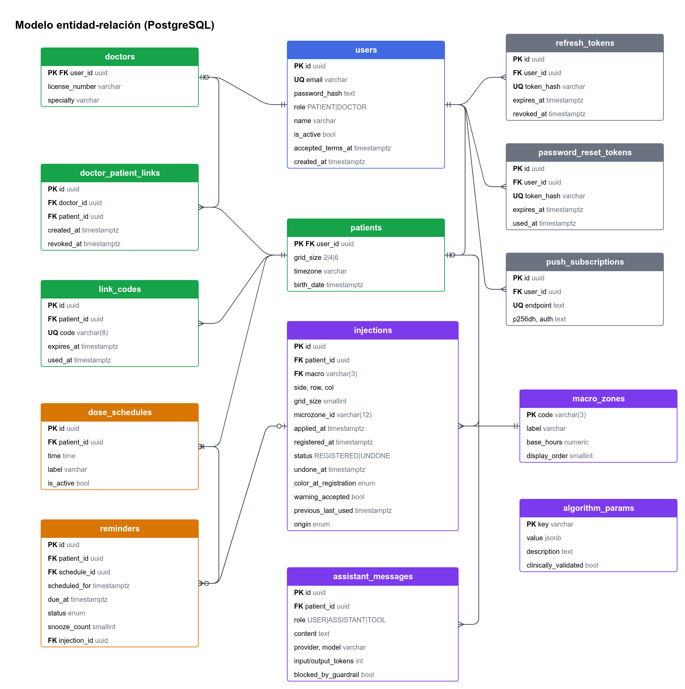

# Modelo de datos

La base de datos es **PostgreSQL** (Neon en producción) y es la **fuente de verdad**. Las estructuras en memoria ([Estructuras de datos y algoritmos](Estructuras-de-datos-y-algoritmos.md)) se **construyen** desde estas tablas, y cada escritura se persiste aquí en la misma operación del servicio.

> Los nombres de tablas, columnas y valores de enum están en **inglés** (regla del código, ver [AGENTS.md](../AGENTS.md)). Fuente: `app/db/models.py` y la migración inicial en `alembic/versions/`.

## Convenciones

- Llaves primarias `uuid` (salvo catálogos).
- Todas las fechas son `timestamptz` en **UTC** (tipo `UTCDateTime`).
- Los enums se guardan como `varchar` con `CHECK`, para que sean portables a SQLite en las pruebas.
- `JSON` se vuelve `JSONB` en PostgreSQL.

## Tablas

### Identidad y acceso (R20–R23)

**`users`**: toda persona que inicia sesión.

| Columna | Tipo | Restricciones / notas |
|---|---|---|
| `id` | `uuid` | PK |
| `email` | `varchar(254)` | UNIQUE; se guarda en minúsculas |
| `password_hash` | `text` | Argon2id |
| `role` | `PATIENT \| DOCTOR` | NOT NULL |
| `name` | `varchar(120)` | |
| `is_active` | `boolean` | default `true` |
| `accepted_terms_at` | `timestamptz` | Consentimiento de tratamiento de datos de salud (RNF-04) |
| `created_at` | `timestamptz` | |

**`refresh_tokens`**: sesiones (R22). Columnas: `id`, `user_id` (FK, cascade), `token_hash` (UNIQUE, SHA-256; nunca se guarda el token plano), `expires_at`, `revoked_at` (NULL = vigente), `created_at`. En cada `/auth/refresh` se revoca el token viejo y se crea uno nuevo (**rotación**).

**`password_reset_tokens`**: recuperación de contraseña (R23). Columnas: `id`, `user_id`, `token_hash` (UNIQUE), `expires_at` (30 min), `used_at`.

**`patients`**: perfil 1:1 con `users` cuando `role = PATIENT`.

| Columna | Tipo | Notas |
|---|---|---|
| `user_id` | `uuid` | PK, FK → `users.id` |
| `grid_size` | `smallint` | CHECK IN (2, 4, 6), default 4 (R02) |
| `timezone` | `varchar(40)` | default `America/Bogota`; se usa para el cronograma y los exportes |
| `birth_date` | `timestamptz` | NULL |

**`doctors`**: perfil 1:1 con `users` cuando `role = DOCTOR`. Columnas: `user_id` (PK, FK), `license_number`, `specialty`.

### Vínculo médico–paciente (R24–R27)

**`link_codes`**: código de un solo uso que genera el paciente. Columnas: `id`, `patient_id`, `code` (`varchar(8)` UNIQUE, sin caracteres ambiguos), `expires_at` (48 h), `used_at`.

**`doctor_patient_links`**: columnas `id`, `doctor_id` (FK → `doctors`), `patient_id` (FK → `patients`), `created_at`, `revoked_at` (NULL = activo). El servicio impide duplicar un vínculo activo (`ALREADY_LINKED`).

### Dominio clínico

**`macro_zones`**: catálogo fijo, cargado por la semilla (R01).

| Columna | Tipo | Notas |
|---|---|---|
| `code` | `varchar(3)` | PK: `ABD`, `MUS`, `BRA`, `GLU` |
| `label` | `varchar(30)` | Nombre visible (español) |
| `base_hours` | `numeric(5,1)` | `T_base` del algoritmo 5.1 (**parámetro clínico por validar**) |
| `display_order` | `smallint` | |

> **La microzona no es una tabla.** Es un concepto derivado de (`macro`, `side`, `row`, `col`, `grid_size`) con el ID `ABD-I-2-3`. Si se cambia el tamaño de la cuadrícula, no hay filas que migrar: el historial se **proyecta** con escalado proporcional (`project_cell`, E1).

**`injections`**: el evento central (R03, R04, R08, R09, R17).

| Columna | Tipo | Notas |
|---|---|---|
| `id` | `uuid` | PK |
| `patient_id` | `uuid` | FK → `patients`, INDEX |
| `macro` | `varchar(3)` | FK → `macro_zones.code` |
| `side` | `varchar(1)` | CHECK IN ('I', 'D') |
| `row`, `col` | `smallint` | 1..`grid_size` |
| `grid_size` | `smallint` | Tamaño vigente al registrar |
| `microzone_id` | `varchar(12)` | `macro-side-row-col`, INDEX |
| `applied_at` | `timestamptz` | Momento de aplicación: base del cálculo (R09) |
| `registered_at` | `timestamptz` | Orden del historial y de la pila de deshacer |
| `status` | `REGISTERED \| UNDONE` | R17 |
| `undone_at` | `timestamptz` | NULL |
| `color_at_registration` | `RED \| YELLOW \| GREEN` | Auditoría de la advertencia (R04) |
| `warning_accepted` | `boolean` | `true` si se registró en RED o YELLOW |
| `previous_last_used` | `timestamptz` | Foto del estado previo (R06, auditoría de la pila E3) |
| `origin` | `MAP \| SUGGESTION \| REMINDER \| ASSISTANT` | Analítica de uso |

Índice compuesto: `(patient_id, registered_at)`. Se usa para construir el `PatientState` en orden de registro.

**`algorithm_params`**: parámetros de los algoritmos 5.1 y 5.2 (R10–R13). Columnas: `key` (PK), `value` (JSON), `description`, `clinically_validated` (default `false`) y `updated_at`.

Claves: `frequency_alpha`, `yellow_threshold`, `green_threshold`, `max_ratio`, `usage_window_days`, `forgotten_days`, `forgotten_beta`, `overuse_gamma`, `neighbor_delta`, `neighbor_hours`, `neighbor_radius`, `top_k`, `undo_window_hours`.

### Recordatorios (R14–R16)

**`dose_schedules`**: cada fila es una hora del día. La frecuencia diaria es el número de filas activas (1 a 6).

| Columna | Tipo | Notas |
|---|---|---|
| `id` | `uuid` | PK |
| `patient_id` | `uuid` | FK |
| `time` | `time` | Hora local del paciente; UNIQUE (`patient_id`, `time`) |
| `label` | `varchar(40)` | p. ej. "Antes del desayuno" |
| `is_active` | `boolean` | Las horas eliminadas se desactivan para conservar el historial |

**`reminders`**: instancias concretas de cada dosis. Son los elementos del **min-heap indexado** (E4).

| Columna | Tipo | Notas |
|---|---|---|
| `id` | `uuid` | PK (llave en el heap) |
| `patient_id`, `schedule_id` | `uuid` | FK |
| `scheduled_for` | `timestamptz` | Franja original; UNIQUE (`schedule_id`, `scheduled_for`) → generación idempotente |
| `due_at` | `timestamptz` | **Prioridad del min-heap**; cambia al posponer |
| `status` | `PENDING \| SENT \| SNOOZED \| CONFIRMED \| SKIPPED` | |
| `sent_at`, `confirmed_at` | `timestamptz` | |
| `snooze_count` | `smallint` | |
| `injection_id` | `uuid` | FK NULL: se llena al registrar desde el recordatorio |

**`push_subscriptions`**: dispositivos del usuario (R15). Columnas: `id`, `user_id`, `endpoint` (UNIQUE), `p256dh`, `auth`, `user_agent` y `created_at`.

### Asistente IA (R28–R30)

**`assistant_messages`**

| Columna | Tipo | Notas |
|---|---|---|
| `id` | `uuid` | PK |
| `patient_id` | `uuid` | FK |
| `role` | `USER \| ASSISTANT \| TOOL` | |
| `content` | `text` | |
| `tool_name` | `varchar(40)` | NULL |
| `provider`, `model` | `varchar` | p. ej. `deepseek`, `deepseek-chat` |
| `input_tokens`, `output_tokens` | `int` | Control de costo (RNF-10) |
| `blocked_by_guardrail` | `boolean` | R30 |
| `created_at` | `timestamptz` | INDEX; también se usa para el límite de 20 mensajes por hora |

## Relaciones

- `users` 1–0..1 `patients`; `users` 1–0..1 `doctors`.
- `patients` N–M `doctors` a través de `doctor_patient_links`.
- `patients` 1–N `injections`, `dose_schedules`, `reminders`, `assistant_messages` y `link_codes`.
- `dose_schedules` 1–N `reminders`; `reminders` 0..1–1 `injections`.
- `macro_zones` 1–N `injections`.
- `users` 1–N `refresh_tokens`, `password_reset_tokens` y `push_subscriptions`.

## De la BD a las estructuras de datos

| Tabla / consulta | Estructura en memoria | Cuándo |
|---|---|---|
| `patients.grid_size` + `MACROS` | 8 × **`Grid`** (4 macros × 2 lados) | Al construir el `PatientState` |
| `injections` del paciente (orden `registered_at`) | **`HashTable`** `index` → `Microzone.last_used` / `uses_30d` | Al construir |
| `injections` con `applied_at` en los últimos 30 días | **`HashTable`** `macro_usage` | Al construir |
| `injections` `REGISTERED` de las últimas 24 h | **`Stack`** de `UndoAction` | Al construir |
| Todas las `injections` | **`DoublyLinkedList`** del historial + `HashTable[id → nodo]` | Al construir |
| Las 8 cuadrículas | **`Graph`** de vecindad | Al construir |
| `reminders` `PENDING`/`SNOOZED` | **`IndexedHeap`** (min) en `ReminderScheduler` | Al iniciar el proceso y al generar o posponer |
| `PatientState` completo | **`LRUCache`** (TTL 5 min, capacidad 128) | Primer acceso de cada paciente |

## Migraciones y semilla

- **Alembic:** `uv run alembic revision --autogenerate -m "..."` y `uv run alembic upgrade head`. Cada PR con cambios de esquema incluye su migración.
- **Semilla** (`app/db/seed.py`, idempotente, se ejecuta al arrancar la app):
  - `macro_zones` y `algorithm_params` con los valores de ejemplo (`clinically_validated = false`).
  - Si `SEED_DEMO_USERS=true`, los usuarios `paciente@demo.insumap` y `medico@demo.insumap` (contraseña `Insumap123`).

## Privacidad

Los datos de inyecciones son **datos de salud (sensibles)**. Ver [Requerimientos no funcionales](Requerimientos-no-funcionales.md): cifrado en tránsito, acceso por rol y vínculo, consentimiento al registrarse y minimización de datos hacia el LLM.

Relacionadas: [API](API.md) · [Arquitectura](Arquitectura.md) · [Trazabilidad](Trazabilidad.md)
