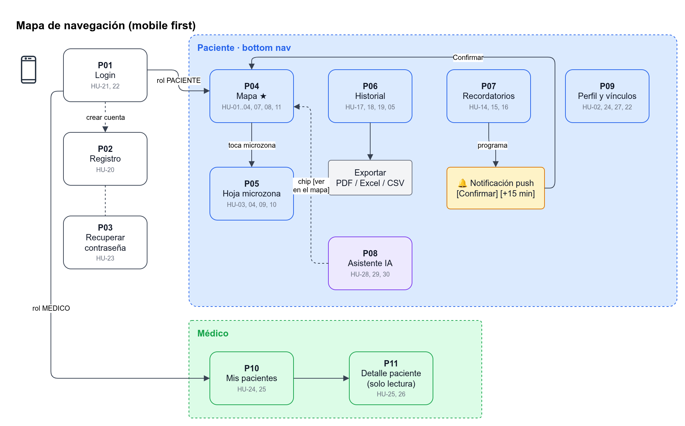

# Pantallas (mobile first)

Insumap se diseña **primero para un celular de 360 × 800 px**, que es el contexto real de uso: el paciente tiene la pluma de insulina en una mano y el celular en la otra. **Tablet y escritorio no son un estiramiento del móvil:** son layouts propios. El mismo flujo (mapa, registro, historial, médico) debe verse completo y usable en una pantalla de PC.



## Principios de diseño

| Principio | Aplicación |
|---|---|
| **Una mano en móvil** | En `< lg` la navegación es inferior (*bottom nav*) y las acciones primarias quedan en el tercio inferior. Los objetivos táctiles miden al menos **44 × 44 px** (con cuadrícula 6×6 se activa el zoom de la zona) |
| **Escritorio de verdad** | Desde `lg` (≥ 1024 px) la navegación pasa a una **barra lateral** fija. El contenido usa hasta ~1152 px, el mapa crece y el médico ve mapa e historial **a la vez** (dos columnas). No se deja la columna de 512 px centrada en una pantalla ancha |
| **Color + forma** | Rojo/amarillo/verde **siempre** acompañados de ícono y patrón (✕ rayado, ! punteado, ✓ sólido) para personas con daltonismo (RNF-05) |
| **Una tarea por pantalla** | Registrar es tocar, confirmar y listo, con opción de deshacer en un *toast* de 10 s |
| **Instalable** | Banner "Agregar a pantalla de inicio" (necesario para push en iOS) |
| **Offline** | El último mapa queda cacheado por el service worker; un registro hecho sin conexión queda en cola y se reintenta |

**Breakpoints (Tailwind):** base `< 640 px` (móvil, una columna, bottom nav) · `md ≥ 768 px` (tablet: mapa y panel de sugerencia lado a lado, contenido hasta 768 px) · `lg ≥ 1024 px` (escritorio: sidebar + contenido hasta 1152 px; médico en dos columnas).

**Navegación del paciente:** en móvil, inferior: `Mapa` · `Historial` · `Asistente` · `Recordatorios` · `Perfil`. En escritorio, los mismos destinos en la barra lateral.
**Navegación del médico:** `Pacientes` · `Perfil` (inferior en móvil, lateral en escritorio).

### Layout de escritorio (regla)

| Pantalla | `< lg` | `≥ lg` |
|---|---|---|
| P01–P03 Login / registro | Columna única | Panel de marca a la izquierda y formulario a la derecha |
| P04 Mapa | Sugerencia arriba, cuerpo abajo | Cuerpo a la izquierda (más alto) y sugerencia fija a la derecha |
| P06 Historial, P07, P08, P09 | Una columna | Misma columna, ancho máximo ~768 px para no estirar filas |
| P11 Detalle del médico | Toggle Mapa / Historial | Mapa e historial visibles a la vez |

---

## P01. Login · P02. Registro · P03. Recuperar contraseña
**HU:** HU-20, HU-21, HU-22, HU-23 · **Endpoints:** `/auth/login`, `/auth/register`, `/auth/forgot-password`, `/auth/reset-password`, `/auth/me`

```text
┌──────────────────────────┐   ┌──────────────────────────┐
│         ◉ Insumap        │   │  ← Crear cuenta          │
│  Rota tus zonas, cuida   │   │  Soy:  (•) Paciente      │
│  tu piel                 │   │        ( ) Médico        │
│                          │   │  Nombre   [____________] │
│  Email    [____________] │   │  Email    [____________] │
│  Contraseña [________ 👁]│   │  Contraseña [__________] │
│                          │   │  (mín. 8, 1 número)      │
│  [   Iniciar sesión    ] │   │  Registro prof. [______] │ ← solo médico
│                          │   │  [✓] Acepto términos y   │
│  ¿Olvidaste tu contraseña│   │      tratamiento de datos│
│  ¿No tienes cuenta?      │   │      de salud            │
│  Regístrate              │   │  [     Crear cuenta    ] │
└──────────────────────────┘   └──────────────────────────┘
```
- Si la sesión sigue vigente (el refresh es válido), la app entra directo al Mapa (paciente) o a Pacientes (médico).
- Los errores se muestran en línea bajo cada campo. Tras 5 intentos fallidos aparece "Intenta en 15 min" (429).

## P04. Mapa corporal (pantalla principal del paciente)
**HU:** HU-01, HU-02, HU-03, HU-04, HU-05, HU-07, HU-08, HU-11 · **Endpoints:** `GET /map`, `GET /suggestions`, `POST /injections`, `POST /injections/undo`

```text
┌──────────────────────────┐
│ Hola, Ana        🔔 08:00│
│ ┌──────────────────────┐ │
│ │ ★ Sugerido ahora:    │ │
│ │ Glúteo der. · sup.ext│ │
│ │ [Ver en el mapa] [¿Por qué?]│ ← abre el Asistente con la pregunta
│ └──────────────────────┘ │
│   [Frente]  [Espalda]    │ ← toggle de vista del cuerpo
│        ( )               │
│      /|‾‾|\    ▦ brazos  │
│     / |▦▦| \  (grid 4x4) │
│       |▦▦|  ← abdomen    │
│       /  \               │
│      |▦  ▦| ← muslos     │
│                          │
│ ✓ verde  ! amarillo  ✕ rojo│
│ [Mapa][Hist][IA][⏰][👤] │
└──────────────────────────┘
```
- **Tocar una microzona** abre la hoja inferior P05.
- La microzona sugerida **pulsa** con un borde ★.
- Al tocar una zona macro se hace zoom a su cuadrícula (obligatorio con 6×6).

## P05. Hoja de microzona (bottom sheet)
**HU:** HU-03, HU-04, HU-09, HU-10

```text
┌──────────────────────────┐
│ ─────                    │
│ Abdomen izq. · F2 C3     │
│ ● AMARILLO  ! 60 % recup.│
│ Disponible en ~38 h      │
│ Último uso: 18-oct 20:10 │
│                          │
│ Hora de aplicación       │
│ [ Ahora ▾ ] 08:05        │
│ [  Registrar inyección  ]│
└──────────────────────────┘
        ↓ (si no está en VERDE)
┌──────────────────────────┐
│ ⚠ Esta zona aún no se    │
│ recupera (AMARILLO).     │
│ Te sugerimos: GLU-D-1-1  │
│ [Usar sugerida] [Registrar igual]│  ← R04: advierte pero no bloquea
└──────────────────────────┘
        ↓ (registrado)
  Toast: "Registrado en ABD-I-2-3 ✓   [Deshacer]"  (10 s; también en Historial)
```

## P06. Historial
**HU:** HU-17, HU-18, HU-19, HU-05 · **Endpoints:** `GET /history`, `GET /history/export`, `POST /injections/undo`

```text
┌──────────────────────────┐
│ Historial      [Exportar]│
│ Filtro: [Todas ▾][30 d ▾]│
│ HOY                      │
│ 08:05 Muslo izq. F1C2  ✓ │
│ ── ayer ──               │
│ 20:10 Abdomen izq. F2C3 ✓│
│ 13:00 Brazo der. F1C1 ↶  │ ← deshecho (tachado)
│ ...                      │
│ [Cargar más]             │ ← paginación por cursor
└──────────────────────────┘
```
- **Exportar** abre una hoja con "PDF / Excel / CSV" y un rango de fechas.

## P07. Recordatorios y cronograma
**HU:** HU-14, HU-15, HU-16 · **Endpoints:** `GET/PUT /schedule`, `POST /push/subscriptions`, `GET /reminders/upcoming`, `POST /reminders/{reminder_id}/snooze|confirm`

```text
┌──────────────────────────┐   Notificación push:
│ Mis dosis (3 al día)     │   ┌────────────────────────┐
│ 07:00 Desayuno     [on]  │   │ Insumap · Hora de tu   │
│ 13:00 Almuerzo     [on]  │   │ dosis de 13:00         │
│ 20:00 Cena         [on]  │   │ Sugerido: Muslo izq.   │
│ [+ Agregar hora] (máx 6) │   │ [Confirmar] [+15 min]  │
│ Notificaciones: ✓ activas│   └────────────────────────┘
│ ⓘ En iPhone instala la   │
│   app para recibir avisos│
└──────────────────────────┘
```
- **Confirmar** abre P04 con la sugerencia preseleccionada (HU-16).
- **Posponer** permite elegir 5, 15, 30 o 60 min.

## P08. Asistente IA
**HU:** HU-28, HU-29, HU-30 · **Endpoints:** `POST/GET /assistant/messages`

```text
┌──────────────────────────┐
│ Asistente Insumap    ⓘ   │
│ ┌──────────────────────┐ │
│ │Hola Ana. Puedo ayudar│ │
│ │te a ubicar tu próxima│ │
│ │zona. No doy consejos │ │
│ │de dosis.             │ │
│ └──────────────────────┘ │
│     ┌─────────────────┐  │
│     │¿Dónde me inyecto│  │
│     │ahora?           │  │
│     └─────────────────┘  │
│ ┌──────────────────────┐ │
│ │Glúteo derecho, parte │ │
│ │superior externa [ver]│ │ ← chip que abre el mapa en esa microzona
│ └──────────────────────┘ │
│ Chips: [¿Por qué esta?] [¿Qué significa amarillo?] [Mi rotación]│
│ [Escribe…           ] [➤]│
└──────────────────────────┘
```

## P09. Perfil y vínculos
**HU:** HU-02, HU-24, HU-27, HU-22 · **Endpoints:** `PUT /settings/grid`, `POST /links/codes`, `GET/DELETE /links`, `POST /auth/logout`

Contiene:
- Tamaño de cuadrícula (2×2 / 4×4 / 6×6).
- "Compartir con mi médico": genera un código y muestra "K7QX-2M9A, vence en 48 h".
- Lista de médicos con acceso [Revocar].
- Cerrar sesión.

## P10. Médico: lista de pacientes · P11. Detalle del paciente
**HU:** HU-24, HU-25, HU-26 · **Endpoints:** `POST /links`, `GET /links`, `GET /doctor/patients/{patient_id}/map|history|history/export`

```text
┌──────────────────────────┐   (≥ lg: dos columnas)
│ Mis pacientes [+ Código] │   ┌───────────┬────────────────┐
│ Ana R.  últ. 08:05  ⚠2   │   │ Mapa (RO) │ Historial      │
│ Luis M. últ. ayer        │   │           │ [Exportar PDF] │
└──────────────────────────┘   └───────────┴────────────────┘
```
- "⚠2" indica cuántas aplicaciones se hicieron en zonas no recuperadas en los últimos 7 días.
- Todo es **solo lectura**.

---

## Accesibilidad (RNF-05)
- Contraste AA. Cada microzona es un botón con `aria-label`, por ejemplo "Abdomen izquierdo fila 2 columna 3, amarillo, disponible en 38 horas".
- Se puede navegar con teclado y lector de pantalla por la lista equivalente al mapa ("Ver como lista").
- Se respeta `prefers-reduced-motion` en la animación de la zona sugerida.

Relacionadas: [API](API.md) · [Historias de usuario](Historias-de-usuario.md) · [Trazabilidad](Trazabilidad.md)
