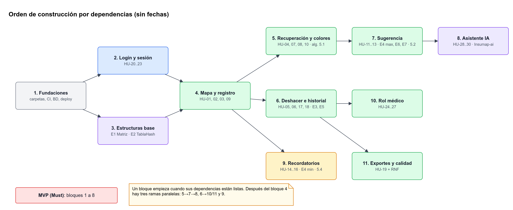

# Planeación

## 1. Equipo

| Integrante |
|---|
| Nicolas Diaz |
| Drako Salazar |
| Nicolas Mora |

Por ahora **no hay roles fijos**. Cada tarea (issue) se asigna en el tablero cuando alguien la toma.

## 2. Repositorios

| Repositorio | Lenguaje | Estado |
|---|---|---|
| [`Insumap-frontend`](https://github.com/NicoalsD/Insumap-frontend) | TypeScript | Creado |
| [`Insumap-backend`](https://github.com/NicoalsD/Insumap-backend) | Python | Creado (contiene esta documentación en `docs/`) |
| `Insumap-ai` | Python | Por crear |

## 3. Metodología

- **Kanban** en GitHub Projects con las columnas `Backlog → Listo → En progreso → En revisión → Hecho`.
- **Una issue por HU**, etiquetada por repositorio (`repo:frontend`, `repo:backend`, `repo:ai`) y por prioridad (`prioridad:must|should|could`).
- Límite de trabajo en progreso: máximo 2 issues por persona.
- Sincronización corta del equipo para revisar el tablero e integrar entre repositorios.

## 4. Backlog priorizado (MoSCoW)

| Prioridad | HU |
|---|---|
| **Must** (MVP) | HU-20, 21, 22 (login) · HU-01, 02, 03, 04, 05, 06, 07, 08, 09, 10 (mapa, registro, recuperación) · HU-11 (sugerencia) · HU-17, 18 (historial) · HU-28, 30 (asistente IA y sus límites) |
| **Should** | HU-12, 13 (penalización y zonas olvidadas) · HU-14, 15, 16 (recordatorios) · HU-19 (exportar) · HU-23 (recuperar contraseña) · HU-24, 25, 26, 27 (rol médico) · HU-29 (explicaciones del asistente) |
| **Could** | Mapa 3D (three.js), registro offline con cola, modo oscuro, gráfica de rotación mensual |
| **Won't (esta versión)** | App nativa, visión por computador, integración con glucómetros |

## 5. Orden de construcción por dependencias

Esta sección **no tiene fechas**. Indica qué bloque necesita a cuál: un bloque puede empezar cuando sus dependencias están listas.

| # | Bloque | HU | Depende de | Repositorios | Estructuras / algoritmos |
|---|---|---|---|---|---|
| 1 | **Fundaciones**: estructura de carpetas, CI, BD, despliegue base | — | — | Los 3 | — |
| 2 | **Login y sesión** | HU-20, 21, 22, 23 | 1 | Backend, Frontend | — |
| 3 | **Estructuras base** | — | 1 | Backend (`app/domain/structures`) | E1 Matriz, E2 Tabla hash (con tests) |
| 4 | **Mapa y registro** | HU-01, 02, 03, 09 | 2, 3 | Backend, Frontend | E1, E2 |
| 5 | **Recuperación y colores** | HU-07, 08, 10, 04 | 4 | Backend, Frontend | Algoritmo 5.1 |
| 6 | **Deshacer e historial** | HU-05, 06, 17, 18 | 4 | Backend, Frontend | E3 Pila, E5 Lista doble |
| 7 | **Sugerencia inteligente** | HU-11, 12, 13 | 5 | Backend, Frontend | E4 Max-heap, E6 Grafo, E7 LRU, algoritmo 5.2 |
| 8 | **Asistente IA** | HU-28, 29, 30 | 7 | IA, Backend, Frontend | Tools sobre E4 |
| 9 | **Recordatorios** | HU-14, 15, 16 | 4 | Backend, Frontend | E4 Min-heap indexado, algoritmo 5.4 |
| 10 | **Rol médico** | HU-24, 25, 26, 27 | 6 | Backend, Frontend | Reutiliza E1, E5, E7 |
| 11 | **Exportes y calidad** | HU-19 + RNF | 6 | Backend, Frontend | E5 (recorrido cronológico) |

**Trabajo en paralelo:** los bloques 2 y 3 son independientes entre sí. Después del bloque 4, las ramas 5→7→8, 6→10/11 y 9 avanzan en paralelo.

**Corte del MVP:** si el tiempo no alcanza, se entregan los bloques 1 a 8 (todos los Must) y los bloques 9 a 11 se presentan como trabajo futuro.

## 6. Definition of Ready (DoR)

Una HU puede pasar a "Listo" solo si tiene:
- Gherkin.
- Endpoint(s) y pantalla(s) identificados en la [Trazabilidad](Trazabilidad.md).
- Dependencias del bloque cumplidas.

## 7. Definition of Done (DoD)

- [ ] El código está en `main` vía PR con **1 aprobación** y CI en verde (lint, tipos, tests).
- [ ] Hay tests: unitarios para las estructuras y algoritmos, de API para los endpoints y de componente para las pantallas clave.
- [ ] Cumple todos los escenarios Gherkin de la HU.
- [ ] Está desplegado y probado en un celular real.
- [ ] La documentación (`docs/`) está actualizada: API, modelo de datos y **Trazabilidad**, si cambiaron.
- [ ] No hay secretos en el código; las variables nuevas están en `.env.example`.

## 8. Integración entre repositorios

- **Contrato primero:** antes de construir un bloque, el backend publica en `openapi.json` las rutas del bloque, aunque devuelvan datos de prueba (*mocks*). Así, frontend e IA avanzan en paralelo.
- El frontend usa **MSW** (mocks en el navegador) mientras el endpoint real no existe.
- Las estructuras de datos se entregan como un paquete importable (`app/domain/structures`) **antes** de los bloques que las usan (ver columna "Estructuras").

Relacionadas: [Trazabilidad](Trazabilidad.md) · [Riesgos](Riesgos.md) · [Convenciones](Convenciones.md)
