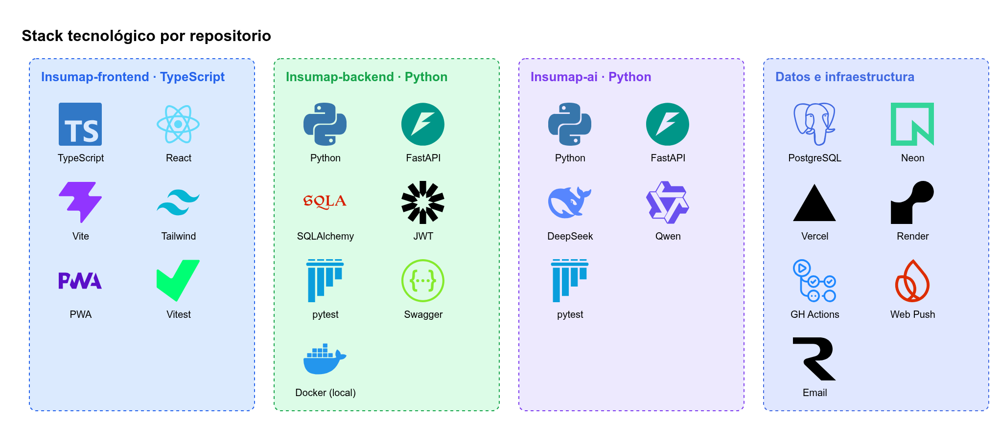

# Stack tecnológico

El stack responde a las **restricciones de la materia**: Python + TypeScript, base de datos, IA y despliegue en varios repositorios. Responde también a las del producto: web mobile first, recordatorios push y costo cercano a cero para un proyecto universitario.

## Frontend: `Insumap-frontend` (TypeScript)

| Tecnología | Uso | Por qué | Alternativa descartada |
|---|---|---|---|
| **TypeScript 5** | Lenguaje | Requisito de la materia; tipos compartidos con el contrato OpenAPI | JavaScript |
| **React 19** | UI | Ecosistema grande y componentes para el mapa interactivo | Vue, Svelte (menos experiencia del equipo) |
| **Vite** | Build y dev server | Arranque instantáneo, plugin PWA oficial | Next.js (SSR innecesario para una app autenticada) |
| **vite-plugin-pwa** (Workbox) | PWA y service worker | App instalable, caché offline del mapa y recepción de Web Push | — |
| **Tailwind CSS 4** | Estilos | **Mobile first por diseño** (las clases base son móvil y `md:`/`lg:` escalan) | CSS Modules |
| **SVG propio** | Mapa corporal | Cada microzona es un `<rect>`/`<path>` con `data-microzona`, accesible y escalable | Canvas (no es accesible), three.js (3D queda como extra) |
| **React Router** | Navegación | Rutas protegidas por rol | TanStack Router |
| **TanStack Query** | Estado del servidor | Caché, reintentos e invalidación tras registrar o deshacer | Redux |
| **React Hook Form + Zod** | Formularios | Validación tipada (login, registro, cronograma) | Formik |
| **openapi-typescript** | Tipos de la API | Los tipos se generan desde el `openapi.json` del backend, sin desalinearse | Tipos escritos a mano |
| **Vitest + Testing Library** | Pruebas | Integración nativa con Vite | Jest |
| **ESLint + Prettier** | Calidad | Estándar | — |

## Backend: `Insumap-backend` (Python)

| Tecnología | Uso | Por qué | Alternativa descartada |
|---|---|---|---|
| **Python 3.12** | Lenguaje | Requisito de la materia; ideal para implementar estructuras de datos | — |
| **FastAPI** | API REST | Tipado, rápido, **Swagger automático** en `/docs`, async | Django REST (más pesado), Flask (menos estructura) |
| **Pydantic v2** | Validación y esquemas | Integrado con FastAPI | marshmallow |
| **SQLAlchemy 2 + Alembic** | ORM y migraciones | Estándar en Python, migraciones versionadas | SQLModel (menos maduro), Django ORM |
| **psycopg 3** | Driver de PostgreSQL | Soporte async | asyncpg |
| **PyJWT + argon2-cffi** | Autenticación | JWT de acceso + refresh; hash Argon2id para contraseñas | Auth de terceros (oculta el aprendizaje) |
| **APScheduler** | Tick del planificador de recordatorios | En el mismo proceso, simple | Celery + Redis (sobredimensionado) |
| **pywebpush** | Web Push (VAPID) | Estándar W3C, gratis | Firebase Cloud Messaging SDK |
| **reportlab / openpyxl / csv** | Exportes PDF / Excel / CSV (R19) | Puro Python | WeasyPrint (dependencias del sistema) |
| **httpx** | Llamadas a `Insumap-ai` | Cliente async | requests |
| **pytest + pytest-cov** | Pruebas | Estándar; cobertura de `domain/` ≥ 90 % | unittest |
| **ruff + mypy** | Lint y tipos | Rápidos | flake8 + black |

## Servicio IA: `Insumap-ai` (Python)

| Tecnología | Uso | Por qué | Alternativa descartada |
|---|---|---|---|
| **FastAPI** | Endpoint `POST /chat` | Mismo stack que el backend | — |
| **SDK `openai` (Python)** | Cliente LLM | DeepSeek y Qwen exponen APIs **compatibles con OpenAI**: cambiar de proveedor es solo cambiar `LLM_BASE_URL` y `LLM_MODEL` | SDKs propios de cada proveedor, LangChain (capa innecesaria) |
| **DeepSeek (`deepseek-chat`)** | LLM principal | Muy bajo costo por token, soporta function calling, buen español | Modelos premium (costo) |
| **Qwen (`qwen-plus` / `qwen-turbo`, Alibaba Model Studio)** | LLM alternativo / respaldo | Económico, function calling, endpoint compatible con OpenAI | — |
| **pytest** | Pruebas | Tools y guardrails probados con un LLM *mock* | — |

> Precios y nombres exactos de modelos: verificar en la documentación oficial de cada proveedor al momento de implementar. Cambian con frecuencia.

## Datos e infraestructura

| Tecnología | Uso | Por qué | Alternativa descartada |
|---|---|---|---|
| **PostgreSQL 16** | Base de datos relacional | Integridad referencial, `timestamptz`, `jsonb` para parámetros | MongoDB (el dominio es relacional) |
| **Neon** | PostgreSQL gestionado | Plan gratuito, *branching* para pruebas | Supabase, RDS (costo) |
| **Vercel** | Hosting del frontend | Plan gratis, deploy por PR, HTTPS (requisito de PWA y Push) | Netlify |
| **Render** | Hosting del backend y la IA | Plan gratis o económico, deploy desde GitHub | Railway, Fly.io |
| **cron-job.org** | Ping de un minuto al tick de recordatorios | Mitiga que Render free se duerma | Instancia paga |
| **Docker Compose** | PostgreSQL local | Mismo motor que en producción | SQLite (difiere de producción) |
| **GitHub + GitHub Actions** | Código, wiki, Projects, CI | Todo en un mismo lugar | GitLab |

## Herramientas del equipo

- **GitHub Projects** (tablero Kanban con las HU como issues).
- **draw.io** (diagramas de esta documentación; los fuentes `.drawio` están en `docs/images/`).
- **Swagger UI** (`/docs`) para probar la API.

Relacionadas: [Arquitectura](Arquitectura.md) · [Módulo IA](Modulo-IA.md) · [Convenciones](Convenciones.md)
